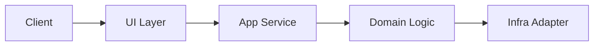
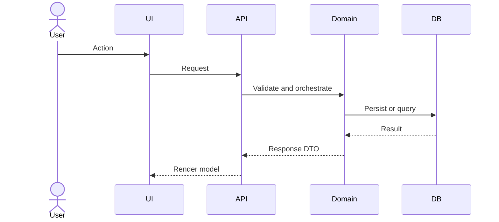

# Architecture Change Note Template

Copy the template below when writing the document. Adjust the title and body to fit the project context.

```markdown
# [Branch / Work Item] Architecture Change Summary

## 1) Background
- Write 2-4 bullets explaining why this change was needed.
- Record the structural purpose, such as extensibility, cleaner boundaries, or lower coupling, rather than feature-level implementation detail.

## 2) Before / After Structure

### Change Summary
- Before: the core constraints of the previous structure
- After: the key structural difference introduced by the change

### Structure Diagram (Required)


## 3) Key Flows
- Summarize the request/data/event flow in five core steps or fewer.

### Sequence Diagram (Required)


## 4) Impact Scope
- affected layers/modules/packages
- compatibility impact (yes/no)
- operational risks and mitigations

## 5) Follow-Up Work
- immediate follow-up tasks such as tests, migration, or monitoring
- open questions and deferred decisions

## 6) Reference Point
- document written at: YYYY-MM-DD
- analyzed git range: e.g. `origin/main...HEAD`
```

## Writing Rules

- Keep at least two Mermaid diagrams.
- Limit implementation detail to 20% or less of the entire document.
- Do not list file names without also explaining their structural meaning.
