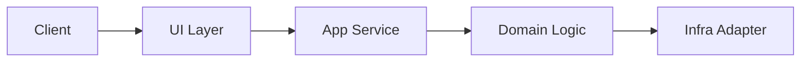
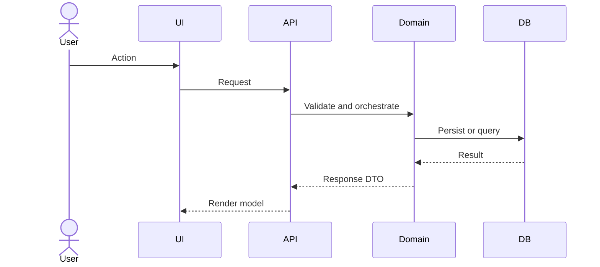

# Architecture Change Note Template

아래 템플릿을 복사해 문서를 작성한다. 제목과 본문은 프로젝트 문맥에 맞게 수정한다.

```markdown
# [브랜치/작업명] 아키텍처 변경 요약

## 1) 변경 배경
- 이번 변경이 필요한 이유를 2~4개 bullet로 작성한다.
- 기능 구현 상세보다 구조적 목적(확장성, 경계 정리, 결합도 감소)을 기록한다.

## 2) 변경 전/후 구조

### 변경 요약
- Before: 기존 구조의 핵심 제약
- After: 변경 후 구조의 핵심 차이

### 구조 다이어그램 (필수)


## 3) 주요 흐름
- 요청/데이터/이벤트 흐름을 핵심 5단계 이내로 정리한다.

### 시퀀스 다이어그램 (필수)


## 4) 영향 범위
- 영향받는 레이어/모듈/패키지
- 호환성 영향(있음/없음)
- 운영 리스크와 완화 방안

## 5) 후속 작업
- 즉시 후속 작업(테스트, 마이그레이션, 모니터링)
- 오픈 질문(결정 보류 항목)

## 6) 기준 시점
- 문서 작성 시점: YYYY-MM-DD
- 분석한 git 범위: 예) origin/main...HEAD
```

## 작성 규칙

- Mermaid 다이어그램은 최소 2개 이상 유지한다.
- 세부 구현 설명은 전체 문서의 20% 이내로 제한한다.
- 파일 목록 그대로 나열하지 말고 구조적 의미를 함께 적는다.
