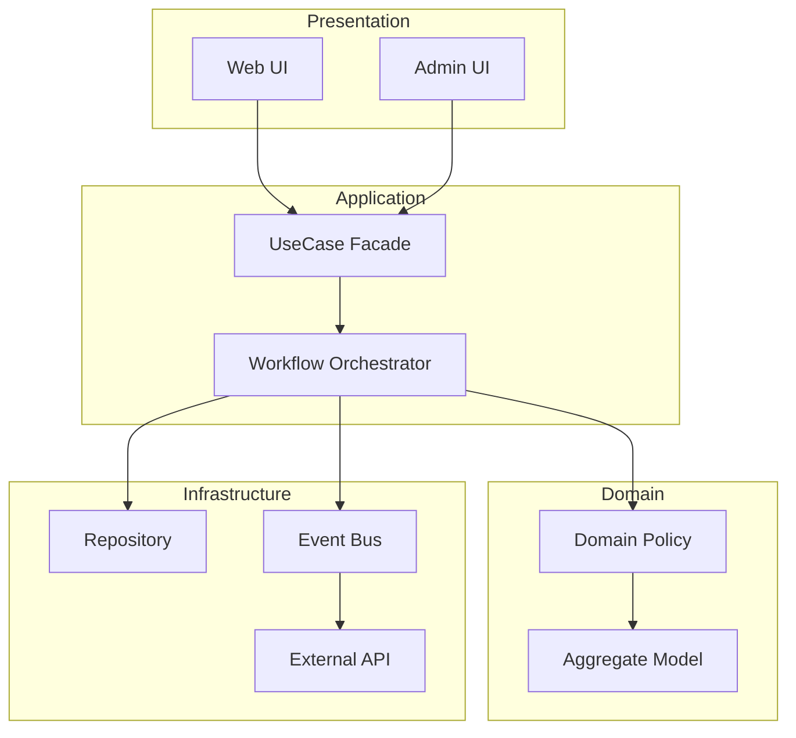
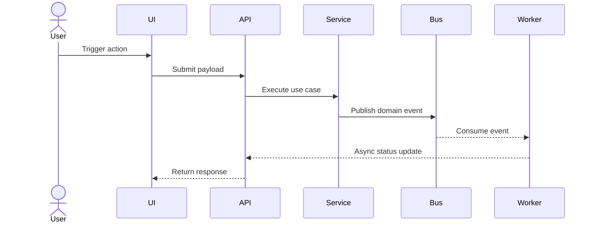
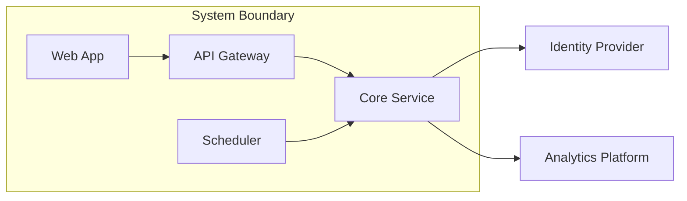
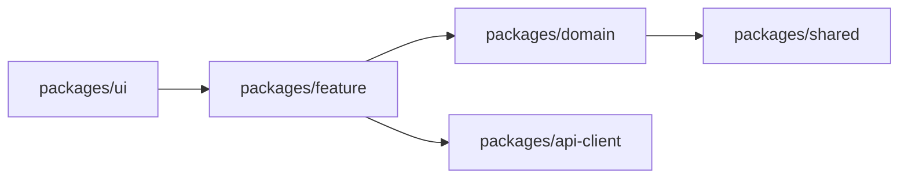

# Mermaid Patterns for Architecture Docs

Choose and use at least two of the patterns below based on the current context.

## 1) Flowchart: Layers / Boundaries

## 2) Sequence: Request / Event Flow

## 3) C4-style Component: Responsibility Split

## 4) Dependency Graph: Package / Module Dependencies

## Selection Guide

- Include `Sequence` when user-facing request/data flow matters.
- Include `Flowchart` when hierarchy and boundaries are the main story.
- Include `Dependency Graph` when package structure changed significantly.
- Include `C4-style Component` when you need to explain system responsibility splits.
