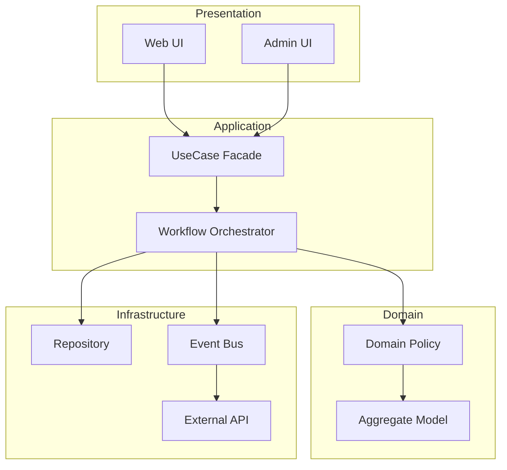
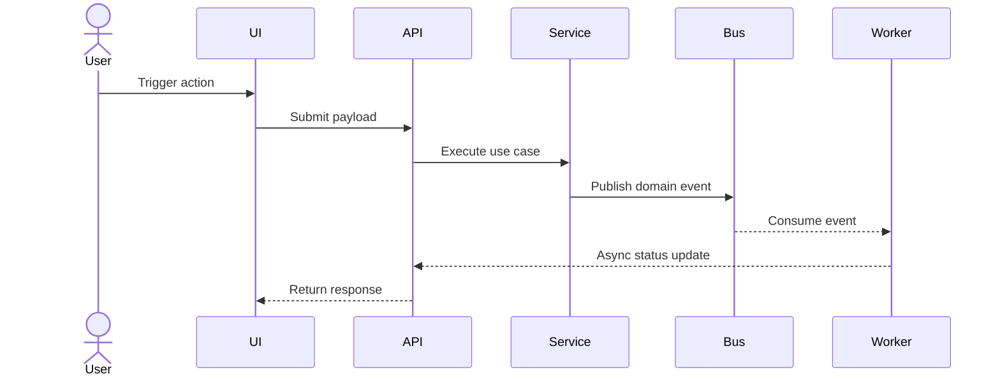
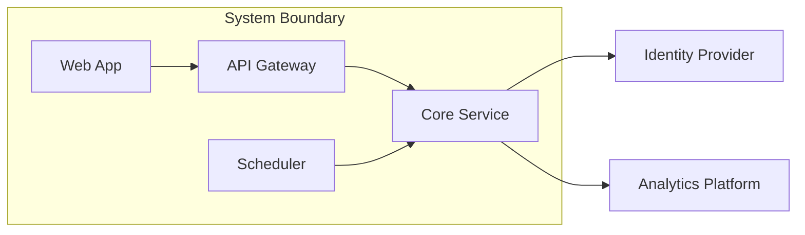
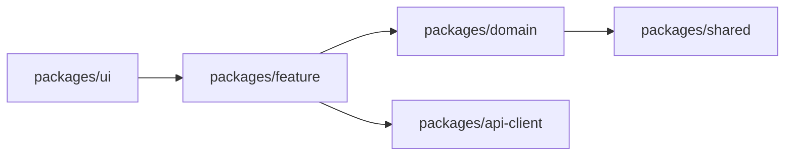

# Mermaid Patterns for Architecture Docs

아래 패턴 중 문맥에 맞는 2개 이상을 선택해 사용한다.

## 1) Flowchart: 레이어/경계

## 2) Sequence: 요청/이벤트 흐름

## 3) C4-style Component: 책임 분리

## 4) Dependency Graph: 패키지/모듈 의존성

## 선택 가이드

- 사용자 요청/데이터 흐름이 중요하면 `Sequence`를 포함한다.
- 계층 구조와 경계 설명이 중요하면 `Flowchart`를 포함한다.
- 패키지 구조 변동이 크면 `Dependency Graph`를 포함한다.
- 시스템 책임 분리 설명이 필요하면 `C4-style Component`를 포함한다.
