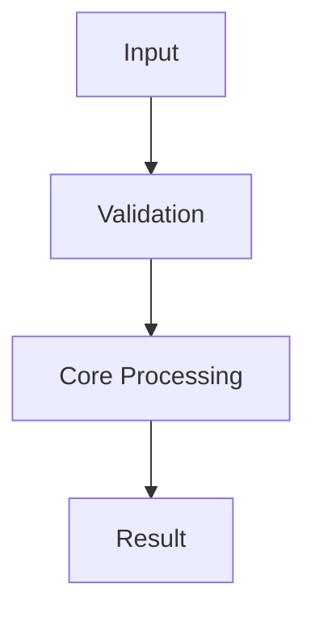

# Korean Cognitive Code Explainer

Reconstruct code explanations to fit the reader's cognitive bandwidth. Do not change
the implementation facts; shorten and clarify the path to understanding.

## Goals

- Lower the difficulty of the explanation itself and reduce working-memory load.
- Show the core decisions and data flow first, then reveal detail gradually.
- Rephrase the explanation in language that feels natural to Korean developers.

## Default Procedure

1. Confirm the code scope.
- Lock the file/function/component scope first.
- If the scope is too broad, narrow it to one entry point and 3-7 core functions.

2. Diagnose cognitive load.
- Look first for nested branching, state-change points, async boundaries, and naming mismatches.
- Follow `${SKILL_DIR}/references/cognitive-principles.md` for the diagnostic lens.

3. Chunk by meaning.
- Group the steps with a frame like `input -> validation -> decision -> execution -> output`.
- Summarize each chunk in 1-3 sentences and add one line explaining why it connects to the next chunk.

4. Build a Korean alias dictionary.
- Keep the original names and add Korean aliases beside them.
- Provide a table in the form `Original | Korean Alias | Role`.
- Follow `${SKILL_DIR}/references/korean-naming-playbook.md` for naming rules.
- Rename actual code only when the user explicitly asks for it.

5. Generate a visualization.
- If the logic has flow or branching, write at least one Mermaid diagram.
- Prefer a sequence diagram for async interaction and a state diagram for state transitions.
- Follow `${SKILL_DIR}/references/visualization-playbook.md` for templates.

6. Output the explanation progressively.
- Start with a 30-second summary.
- Then provide chunk-by-chunk detail.
- End with confusing points and debugging checkpoints.

## Output Format

Use the format below as the default template. Compress or expand sections as needed.

````md
# Code Understanding Report: <Target>

## 30-Second Summary
- ...

## Korean Alias Dictionary
| Original | Korean Alias | Role |
| --- | --- | --- |

## Execution Flow (Mermaid)


## Chunk-by-Chunk Explanation
### Chunk 1: <Name>
- Input:
- Key decision:
- Output:

### Chunk 2: <Name>
- Input:
- Key decision:
- Output:

## Easy-to-Miss Points
- ...

## Debugging Checkpoints
- ...
````

## Explanation Rules

- Keep one concept per sentence.
- Keep each paragraph to three sentences or fewer.
- Use English alongside a Korean term only on first mention, then prefer the Korean term afterward.
- Explain not just what it does, but why the order matters.
- Do not guess uncertain details; mark them as `needs confirmation`.

## Difficulty Tuning

- For beginner requests, include one analogy and one small example.
- For advanced requests, keep it concise and focus on control flow, complexity, and trade-offs.
- If the user did not request a length, present it as "short explanation -> detailed explanation".

## Reference Loading Rules

- Load `${SKILL_DIR}/references/cognitive-principles.md` when you need cognitive-science rationale.
- Load `${SKILL_DIR}/references/korean-naming-playbook.md` when you need Korean naming guidance.
- Load `${SKILL_DIR}/references/visualization-playbook.md` when you need help choosing a Mermaid format.
