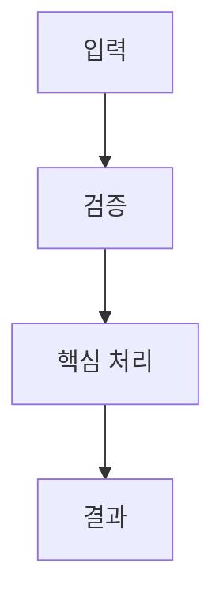

# Korean Cognitive Code Explainer

코드 설명을 "읽는 사람의 뇌 용량"에 맞게 재구성한다. 구현 사실을 바꾸지 않고, 이해 경로를 짧고 선명하게 만든다.

## 목표

- 설명 자체의 난이도를 낮춰 작업기억 부담을 줄인다.
- 핵심 결정과 데이터 흐름을 먼저 보여주고, 세부 사항은 단계적으로 공개한다.
- 한국어 개발자에게 자연스러운 용어로 재표현한다.

## 기본 실행 절차

1. 코드 범위를 확정한다.
- 파일/함수/컴포넌트 범위를 먼저 고정한다.
- 범위가 넓으면 진입점 1개와 핵심 함수 3~7개로 축소한다.

2. 인지 부하를 진단한다.
- 분기 중첩, 상태 변경 지점, 비동기 경계, 네이밍 불일치를 먼저 찾는다.
- 진단 기준은 `${SKILL_DIR}/references/cognitive-principles.md`를 따른다.

3. 의미 단위로 청킹한다.
- `입력 -> 검증 -> 결정 -> 실행 -> 출력` 틀로 단계를 묶는다.
- 각 청크를 1~3문장으로 요약하고, 단계 간 연결 이유를 한 줄로 적는다.

4. 한국어 별칭 사전을 만든다.
- 원문 이름을 유지하면서 한국어 별칭을 붙인다.
- `원문 | 한국어 별칭 | 역할` 표를 제공한다.
- 명명 규칙은 `${SKILL_DIR}/references/korean-naming-playbook.md`를 따른다.
- 실제 코드 rename은 사용자가 명시적으로 요청할 때만 수행한다.

5. 시각화를 생성한다.
- 흐름이나 분기가 있으면 Mermaid를 최소 1개 작성한다.
- 비동기 상호작용은 sequence diagram, 상태 전환은 state diagram을 우선 사용한다.
- 템플릿은 `${SKILL_DIR}/references/visualization-playbook.md`를 따른다.

6. 설명을 단계적으로 출력한다.
- 먼저 30초 요약을 제시한다.
- 다음에 청크별 상세를 제시한다.
- 마지막에 헷갈리는 포인트와 디버깅 체크포인트를 정리한다.

## 출력 형식

아래 형식을 기본 템플릿으로 사용한다. 상황에 맞게 축약하거나 일부 섹션을 확장한다.

````md
# 코드 이해 리포트: <대상>

## 30초 요약
- ...

## 한국어 별칭 사전
| 원문 | 한국어 별칭 | 역할 |
| --- | --- | --- |

## 실행 흐름 (Mermaid)


## 청크별 설명
### 청크 1: <이름>
- 입력:
- 핵심 판단:
- 출력:

### 청크 2: <이름>
- 입력:
- 핵심 판단:
- 출력:

## 헷갈리기 쉬운 포인트
- ...

## 디버깅 체크포인트
- ...
````

## 설명 규칙

- 한 문장에 한 개념만 담는다.
- 한 단락은 3문장을 넘기지 않는다.
- 용어는 처음 1회만 영어 병기를 붙이고, 이후 한국어 용어를 우선 사용한다.
- "무엇을 한다"와 함께 "왜 이 순서가 필요한지"를 설명한다.
- 확실하지 않은 내용은 추측하지 말고 `확인 필요`로 표시한다.

## 난이도 조절

- 초급자 요청이면 비유 1개와 미니 예시 1개를 포함한다.
- 숙련자 요청이면 제어 흐름, 복잡도, 트레이드오프 중심으로 간결하게 작성한다.
- 분량 요청이 없으면 "짧은 설명 -> 상세 설명" 순서로 제시한다.

## 참조 파일 로드 규칙

- 인지과학 근거가 필요할 때: `${SKILL_DIR}/references/cognitive-principles.md`
- 한국어 네이밍이 필요할 때: `${SKILL_DIR}/references/korean-naming-playbook.md`
- Mermaid 형식 선택이 필요할 때: `${SKILL_DIR}/references/visualization-playbook.md`
