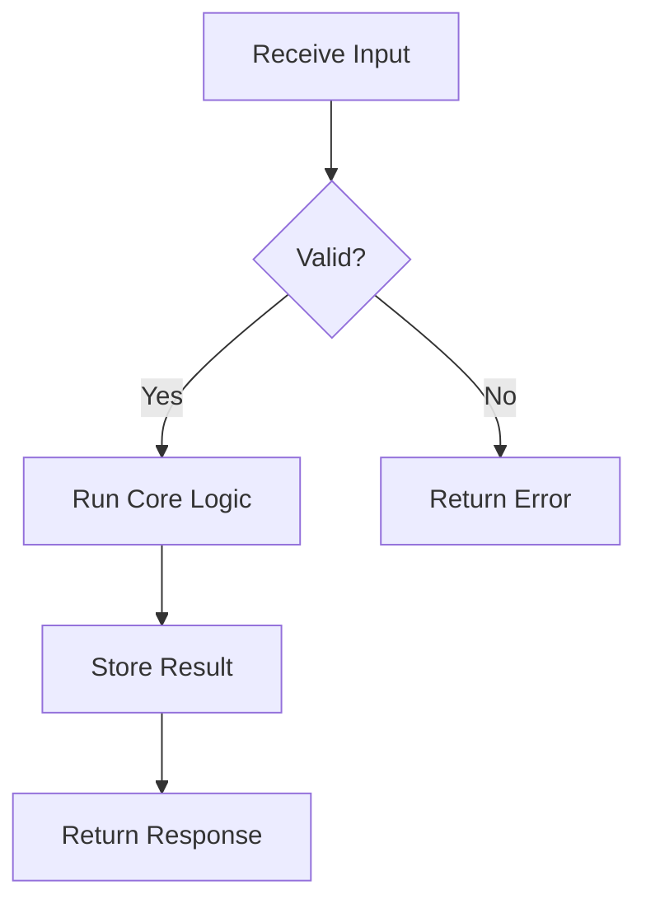
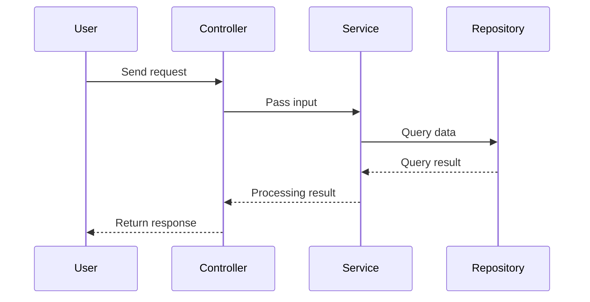
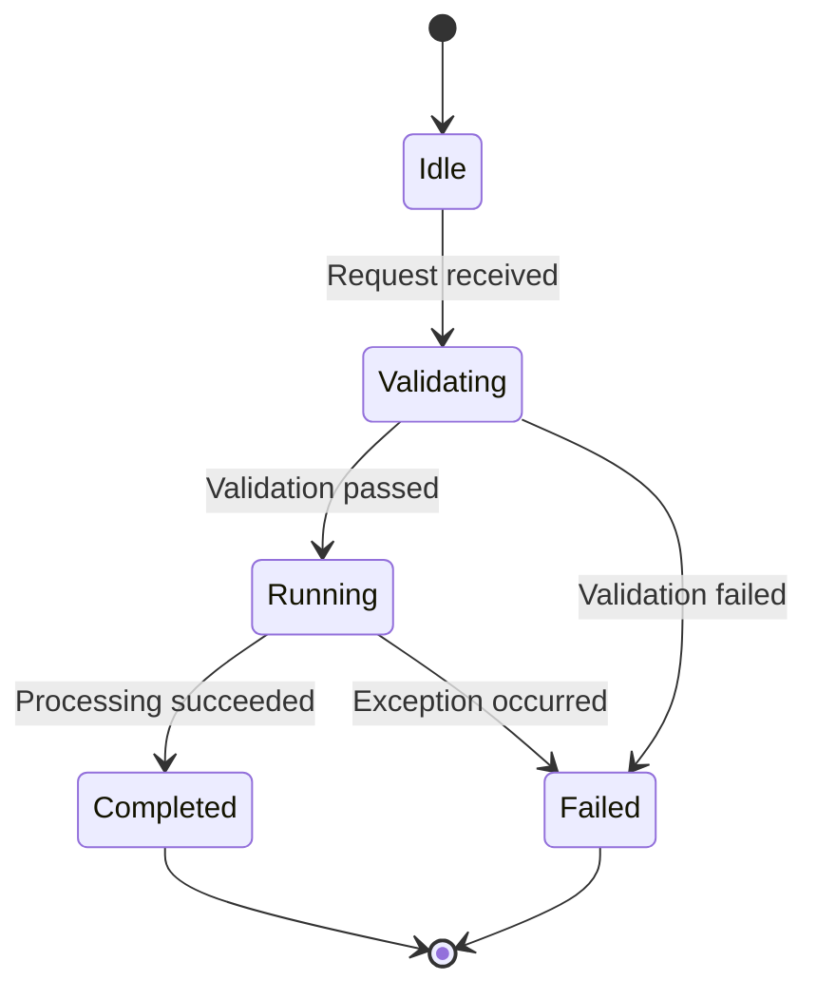

# Visualization Playbook

## Diagram Selection Rules

- Use `flowchart` when you need to break down execution flow.
- Use `sequenceDiagram` for async calls or interaction between actors.
- Use `stateDiagram-v2` when state transitions are the core story.
- Use `classDiagram` or a simple C4 style for module responsibilities and dependencies.

## Template 1: Flowchart

## Template 2: Sequence

## Template 3: State Transition

## Quality Checklist

- Are node labels role-centered?
- Does each branching label include both the condition and the outcome?
- Do arrow directions match the real execution order?
- Do the text explanation and the diagram use the same terms?
- Are the happy path and exception path clearly separated?
