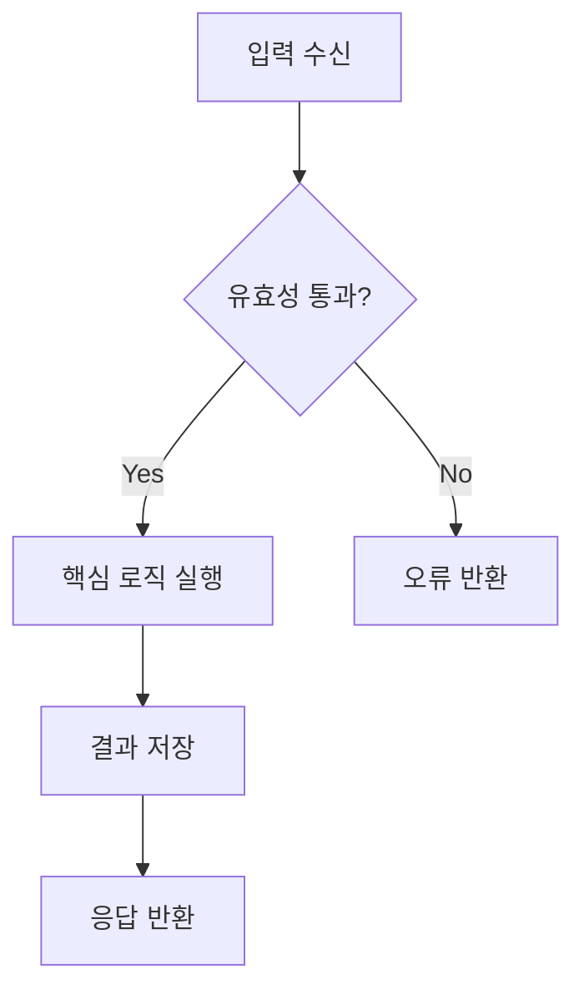
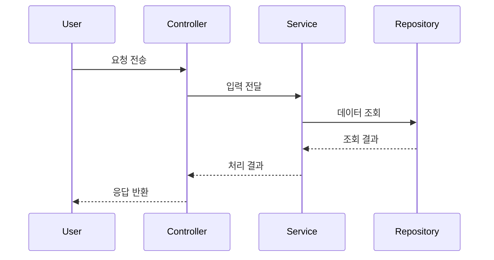
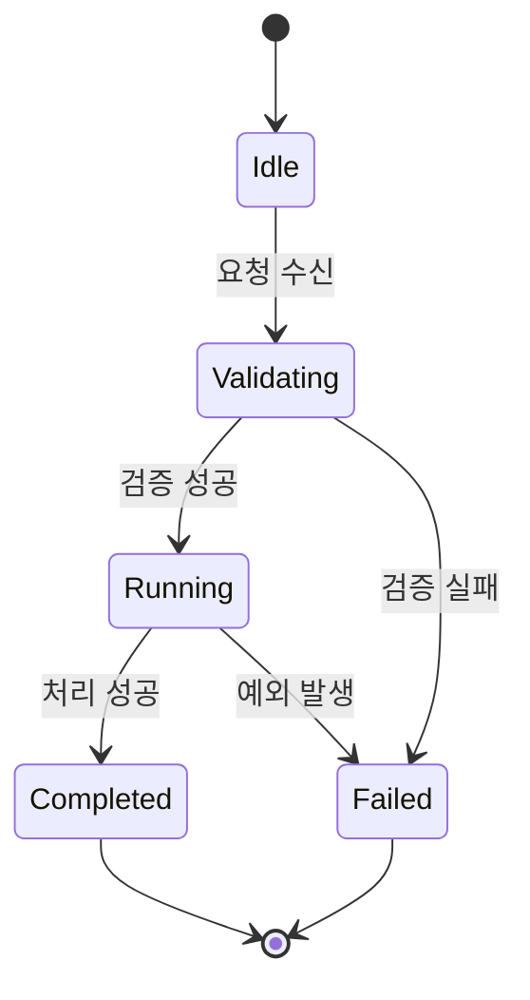

# Visualization Playbook

## 다이어그램 선택 규칙

- 흐름 분해가 필요하면 `flowchart`를 사용한다.
- 비동기 호출, 주체 간 상호작용이면 `sequenceDiagram`을 사용한다.
- 상태 전환이 핵심이면 `stateDiagram-v2`를 사용한다.
- 모듈 책임과 의존 관계면 `classDiagram` 또는 간단한 C4 스타일을 사용한다.

## 템플릿 1: 흐름도

## 템플릿 2: 시퀀스

## 템플릿 3: 상태 전환

## 품질 체크리스트

- 노드는 역할 중심 이름으로 작성했는가?
- 분기 기준 문구가 조건과 결과를 함께 담는가?
- 화살표 방향이 실제 실행 순서와 일치하는가?
- 텍스트 설명과 다이어그램이 같은 용어를 쓰는가?
- "정상 경로"와 "예외 경로"가 구분되는가?
