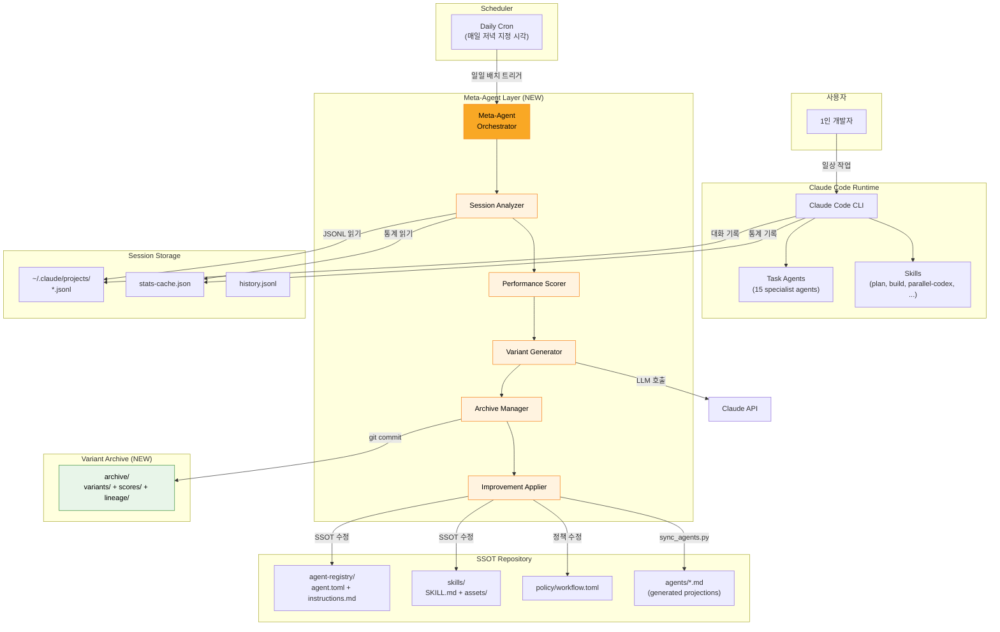
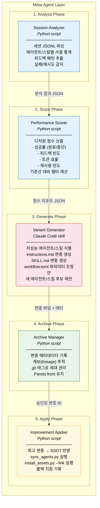
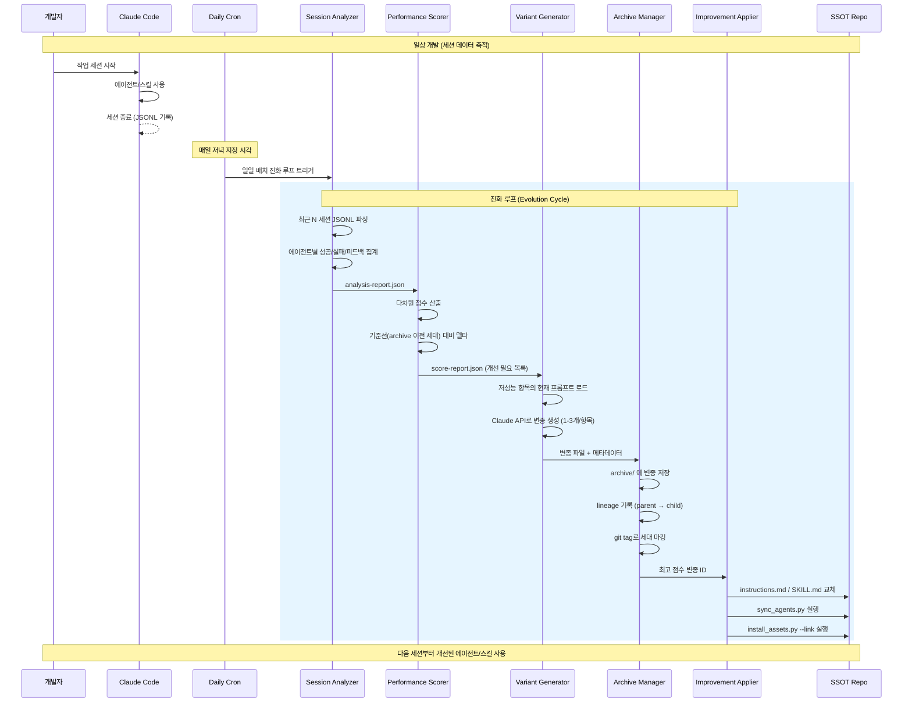

<!-- Status: flesh -->
<!-- Confidence: high -->
<!-- doc_type: architecture-context -->

# Architecture Context: HyperAgent Self-Improvement Layer

## Scope Boundary

**Inside** (이 설계의 범위):
- **Session Analyzer**: 세션 JSONL 파싱 및 에이전트/스킬 성능 신호 추출
- **Performance Scorer**: 추출된 신호를 정량 점수로 변환 (성공률, 피드백 빈도, 토큰 효율)
- **Variant Generator**: 기존 에이전트 프로파일/스킬 프롬프트의 개선 변종 생성
- **Archive Manager**: 변종 이력을 git-tracked 구조로 관리 (HyperAgents의 archive 매핑)
- **Improvement Applier**: 검증된 변종을 SSOT에 반영하고 sync/install 파이프라인 트리거
- **오케스트레이션 정책 자동 조정**: workflow.toml 파라미터 튜닝
- **새 에이전트/스킬 자동 생성**: 반복 패턴 감지 시 skill-creator/bootstrap_registry 활용

**Outside** (범위 밖):
- 모델 파인튜닝 (Claude/GPT 가중치 변경 없음)
- 팀 공유 메커니즘 (1인 개발자 전용)
- 인-세션 실시간 자기수정 (세션 간 개선만 수행)
- Claude Code 런타임 자체 수정 (Anthropic 소유)
- 프로젝트 간 학습 전이 (향후 확장)
- 메타-메타 루프 (향후 확장)

## System Context (C4 Level 1)

[ASSUMPTION][candidate] 메타 에이전트 레이어는 Claude Code 세션 종료 후 비동기로 동작하며, SSOT 저장소를 유일한 상태 저장소로 사용한다.

- **Users / Actors**: 1인 개발자 (CLI를 통한 일상 개발 작업)
- **External systems called**: Claude API (변종 생성 시 LLM 호출), Git (변종 아카이브 커밋)
- **External systems calling us**: cron (일일 배치로 진화 루프 트리거)

## Container View (C4 Level 2)

각 컨테이너는 독립 실행 가능한 Python 스크립트 또는 Claude Code 스킬이다.

### 컨테이너별 상세

| 컨테이너 | 기술 | 핵심 책임 | 입력 | 출력 |
|-----------|------|-----------|------|------|
| **Session Analyzer** | Python script | JSONL 파싱, 에이전트/스킬별 메트릭 추출 | `*.jsonl`, `stats-cache.json` | `analysis-report.json` |
| **Performance Scorer** | Python script | 다차원 점수화, 기준선 비교, 개선 대상 순위 | `analysis-report.json` | `score-report.json` |
| **Variant Generator** | Claude Code skill | LLM 기반 프롬프트/설정 변종 생성 | `score-report.json`, 현재 SSOT | 변종 파일들 (`*.variant.md`) |
| **Archive Manager** | Python script | 변종 저장, 계보 추적, 세대 관리 | 변종 파일들 | `archive/` 디렉토리 갱신 |
| **Improvement Applier** | Python script | SSOT 반영, 파이프라인 실행, 롤백 지원 | 승인된 변종 | SSOT 파일 갱신 |

## Data Flow

[ASSUMPTION][confirmed] 진화 루프는 일일 배치 cron(매일 저녁 지정 시각)으로 트리거되며, 전일 세션을 일괄 분석한다. Stop hook 기반 트리거는 사용하지 않는다. (검증: ADR-0004)

### 데이터 흐름 요약

1. **Session JSONL → Session Analyzer**: `~/.claude/projects/<project>/<uuid>.jsonl` 파싱. 메시지, 도구 호출, 결과, 타임스탬프, 에이전트 식별자 추출.
2. **Session Analyzer → Performance Scorer**: 에이전트/스킬별 집계 메트릭 (호출 횟수, 성공률, 평균 토큰, 사용자 피드백 빈도) JSON 전달.
3. **Performance Scorer → Variant Generator**: 개선 필요 항목 순위 목록 + 점수 근거. 개선 임계값 미달 항목은 필터링.
4. **Variant Generator → Archive Manager**: 생성된 변종 파일과 메타데이터 (부모 ID, 변경 근거, 변경 diff).
5. **Archive Manager → Improvement Applier**: Pareto front 기준 최적 변종 선택 결과.
6. **Improvement Applier → SSOT**: `agent-registry/*/instructions.md`, `skills/*/SKILL.md`, `policy/workflow.toml` 직접 수정 후 `sync_agents.py` + `install_assets.py --link` 실행.

## HyperAgents DGM-H 매핑

HyperAgents(Meta)의 핵심 개념이 이 시스템에 어떻게 대응되는지 정리한다.

| HyperAgents 개념 | 이 시스템의 매핑 | 비고 |
|-------------------|------------------|------|
| **Task Agent** | 기존 15개 specialist agents + skills | `agent-registry/`, `skills/` |
| **Meta Agent** | Meta-Agent Layer (신규) | Session Analyzer ~ Improvement Applier |
| **Single Editable Program** | `instructions.md` + `SKILL.md` (텍스트 프로그램) | 에이전트/스킬의 동작 = 프롬프트 텍스트 |
| **Generate** | Variant Generator | LLM 기반 프롬프트 변종 생성 |
| **Evaluate** | Performance Scorer (세션 데이터 기반 사후 평가) | 실시간 샌드박스 평가 대신 실사용 데이터 활용 |
| **Archive** | `archive/` 디렉토리 (git-tracked) | 변종 이력 + 계보 + 점수 |
| **Select Parent** | Archive Manager의 Pareto front 선택 | 다차원 점수 기반 |
| **Evolutionary Loop** | Daily Cron → Analyze → Score → Generate → Archive → Apply | 일일 배치 비동기 루프 |
| **Emergent Infrastructure** | 새 에이전트/스킬 자동 생성 | 반복 패턴 감지 시 `bootstrap_registry.py` + `skill-creator` 활용 |
| **Meta-cognitive self-modification** | 향후 확장 (메타-메타 루프) | 현재 범위 밖 |

### 핵심 차이점

HyperAgents는 코드(Python 함수) 자체를 진화시키지만, 이 시스템은 **프롬프트 텍스트**를 진화시킨다. 이는 의도적 선택이다:
- Claude Code의 에이전트/스킬 동작은 프롬프트로 정의됨 (코드가 아님)
- 프롬프트 변종 생성은 LLM의 강점에 정확히 부합
- `instructions.md`와 `SKILL.md`는 "단일 편집 가능 프로그램"의 텍스트 버전

## Managed Agents Session 패턴 적용

Anthropic의 Managed Agents 아키텍처에서 차용하는 패턴:

| Managed Agents 개념 | 적용 방식 |
|---------------------|-----------|
| **Session = append-only event log** | `*.jsonl`이 바로 이 역할. 세션별 모든 메시지/도구 호출/결과가 시간순 기록. Meta-Agent는 이를 읽기 전용으로 소비. |
| **Harness = stateless control loop** | Meta-Agent Orchestrator가 이 역할. 상태를 자체 보유하지 않고, archive/ + SSOT의 현재 상태에서 매번 재계산. |
| **Brain vs Hands decoupling** | Variant Generator(Brain, LLM 호출)와 Improvement Applier(Hands, 파일 I/O + 스크립트 실행) 분리. |
| **Cattle-not-pets** | 변종은 일회용. 더 나은 변종이 나오면 이전 변종은 archive에만 잔존. SSOT의 현재 상태가 유일한 "살아있는" 버전. |

[ASSUMPTION][candidate] 세션 JSONL은 Claude Code가 자동 생성하므로, Meta-Agent Layer는 별도 로깅 인프라 없이 기존 세션 데이터만으로 충분히 동작한다.

## Ownership Boundaries

| 컴포넌트 | 소유 |
|----------|------|
| `scripts/meta_analyze.py` (Session Analyzer) | meta-agent 모듈 (신규) |
| `scripts/meta_score.py` (Performance Scorer) | meta-agent 모듈 (신규) |
| `skills/meta-improve/` (Variant Generator) | skills 디렉토리 (신규 스킬) |
| `scripts/meta_archive.py` (Archive Manager) | meta-agent 모듈 (신규) |
| `scripts/meta_apply.py` (Improvement Applier) | meta-agent 모듈 (신규) |
| `archive/` (Variant Archive) | meta-agent 데이터 (신규) |
| `agent-registry/` | 기존 SSOT (Improvement Applier가 수정) |
| `skills/` | 기존 SSOT (Improvement Applier가 수정) |
| `policy/workflow.toml` | 기존 정책 (Improvement Applier가 수정) |
| `scripts/sync_agents.py` | 기존 파이프라인 (변경 없이 호출만) |
| `scripts/install_assets.py` | 기존 파이프라인 (변경 없이 호출만) |

## Invariants

시스템 외부에서 항상 참이어야 하는 불변식:

- **Invariant 1 — SSOT 무결성**: Meta-Agent Layer는 `agent-registry/`, `skills/`, `policy/` 파일만 수정한다. 수정 후 반드시 `sync_agents.py` + `install_assets.py --link`를 실행하여 projection과 SSOT 간 일관성을 보장한다.
- **Invariant 2 — 롤백 가능성**: 모든 SSOT 변경은 git commit으로 추적된다. 임의 시점으로 `git revert`로 복원 가능하다. Improvement Applier는 변경 전 상태의 commit hash를 기록한다.
- **Invariant 3 — 비파괴적 진화**: Meta-Agent는 세션 JSONL을 읽기 전용으로만 접근한다. 원본 세션 데이터를 절대 수정하지 않는다.
- **Invariant 4 — 기존 파이프라인 호환**: `sync_agents.py`, `install_assets.py`의 인터페이스를 변경하지 않는다. Meta-Agent는 기존 스크립트를 현재 CLI 계약대로 호출만 한다.
- **Invariant 5 — 비용 상한**: 단일 진화 사이클의 LLM API 호출은 설정된 토큰 예산 이내여야 한다.

[ASSUMPTION][confirmed] Invariant 5의 비용 상한: 사이클당 $5 하드캡, 월 $30 예산. 토큰 단위가 아닌 비용(USD) 기준. 예상 사이클 비용 ~$2.63 (Opus 기준). (검증: NFR.md:19-32)

## Decision Candidates

(ADR로 승격하여 상세 논의 필요)

**진화 트리거 전략 (확정)**: 일일 배치 cron을 채택한다. 매일 저녁 지정 시각에 cron이 전일 세션을 일괄 분석하고, 필요 시 전체 진화 루프를 실행한다. Stop hook 기반 트리거는 사용하지 않으며, 비용 효율과 충분한 데이터 축적을 동시에 확보한다. (ADR-0004 참조)

**변종 평가 전략 (확정)**: 실사용 데이터를 기본으로 하되, 커밋 반영률(git blame 기반)을 보조 지표로 활용한다. 자동 개선된 프로파일/스킬의 내용이 실제 코드 커밋에 얼마나 반영되었는지를 측정하여, 세션 피드백만으로는 포착하기 어려운 실질적 기여도를 보완한다. 합성 벤치마크나 LLM-as-Judge는 현 단계에서 도입하지 않는다. (ADR-0001 참조)

**안전 경계 수준 (확정)**: 3-Tier 단계적 적용을 채택한다. Tier 1(기존 에이전트 프로파일 미세 조정)은 즉시 자동 적용, Tier 2(스킬 프롬프트 수정, 오케스트레이션 파라미터 변경)는 관찰 기간 후 자동 적용, Tier 3(새 에이전트/스킬 생성, 근본적 재설계)는 사용자 승인 후 적용한다. (ADR-0002 참조)

**archive 저장 전략 (확정)**: Git 태그 + archive.jsonl 방식을 채택한다. 변종 메타데이터는 `archive.jsonl`(append-only JSONL)에 기록하고, 의미 있는 세대(generation)는 Git 태그로 마킹한다. 동일 SSOT repo 내에서 관리하되, 태그 기반 세대 구분으로 히스토리 탐색을 용이하게 한다. (ADR-0003 참조)

## Dependencies

- **Inbound**:
  - cron (일일 배치) — 진화 루프 트리거
  - 세션 JSONL (`~/.claude/projects/`) — 성능 데이터 소스
  - `stats-cache.json` — 집계 통계 보조 소스
  - `history.jsonl` — 세션 메타데이터 (프로젝트, 타임스탬프)

- **Outbound**:
  - Claude API — Variant Generator의 LLM 호출
  - Git — archive 커밋, SSOT 변경 커밋
  - `sync_agents.py` — 에이전트 projection 재생성
  - `install_assets.py --link` — 변경사항 설치

- **Runtime**:
  - Python 3.11+ (기존 스크립트와 동일)
  - cron (시스템 cron 또는 launchd)
  - Anthropic API 키 (변종 생성용)

- **Build-time**:
  - 없음 (Python 스크립트, 별도 빌드 불필요)

## Extension Points

[QUESTION][nice-to-have] 프로젝트 간 학습 전이 시 archive의 공유 범위는 어디까지인가?

- **프로젝트 간 학습 전이**: archive의 변종 점수/계보 데이터를 프로젝트 경계를 넘어 공유. 범용적 개선 (예: "더 구체적인 오류 메시지 요청" 패턴)은 전이 가능.
- **메타-메타 루프**: Meta-Agent Layer 자체의 파라미터(배치 크기 N, 점수 가중치, 변종 생성 수)를 자동 튜닝. DGM-H의 핵심 개념.
- **새로운 점수 차원 추가**: Performance Scorer에 플러그인 방식으로 새 메트릭 추가 (예: 코드 품질 점수, 빌드 성공률).
- **외부 피드백 소스 통합**: GitLab CI 결과, 린터 출력 등을 Session Analyzer의 보조 입력으로 추가.

## Open Questions

[ASSUMPTION][confirmed] 세션 JSONL 파싱 전략: assistant 메시지의 tool_use에서 tool_name=="Skill"이면 스킬 감지(input.skill 필드), tool_name=="Agent"이면 에이전트 감지(input.subagent_type 필드). user 메시지에서 $/<pattern>으로 스킬 호출 감지. (검증: API-CONTRACT.md 인터페이스 1, ANALYTICS.md:248-272)

[ASSUMPTION][confirmed] 새 에이전트 생성 시 agent.toml 기본값: `projection.repo = true, projection.codex = true`. 14개 기존 에이전트 중 13개가 이 패턴. 유일한 예외(explorer)는 source=codex-builtin-override 특수 케이스. (검증: agent-registry/*/agent.toml 전수 조사)

[QUESTION][nice-to-have] archive/ 디렉토리의 가지치기(pruning) 정책 — 세대 수 상한 또는 용량 상한이 필요한가?

## References

- PRD: `../PRD.md`
- ADRs: `../adr/`
- API Contract: `../API-CONTRACT.md`
- NFR: `../NFR.md`
- Analytics: `../ANALYTICS.md`
- Meta HyperAgents 논문: https://arxiv.org/abs/2603.19461
- Anthropic Managed Agents 아키텍처: https://www.anthropic.com/engineering/managed-agents
- HyperAgents 소스코드: https://github.com/facebookresearch/Hyperagents
